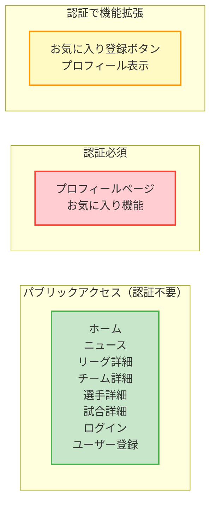
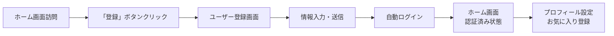
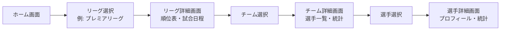
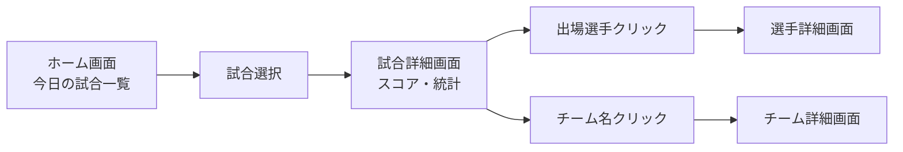
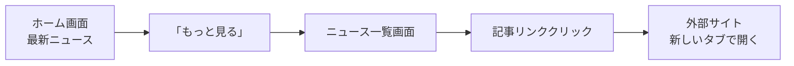

# Football Hub - 画面遷移図

## 概要

Football Hubプロジェクトの画面遷移とユーザーフローを整理した図です。
Next.js App Routerベースの構造に基づいた各ページ間の遷移関係を表現しています。

## 画面構成概要

### 主要画面カテゴリ

- **認証系**: ログイン、ユーザー登録
- **メイン画面**: ホーム、ニュース
- **コンテンツ詳細**: リーグ、チーム、選手、試合詳細
- **ユーザー専用**: プロフィール、お気に入り

## 画面遷移図

```mermaid
graph TD
    %% スタイル定義
    classDef authPage fill:#e1f5fe,stroke:#0277bd,stroke-width:2px
    classDef mainPage fill:#f3e5f5,stroke:#7b1fa2,stroke-width:2px
    classDef detailPage fill:#e8f5e8,stroke:#388e3c,stroke-width:2px
    classDef userPage fill:#fff3e0,stroke:#f57c00,stroke-width:2px
    classDef apiPage fill:#fce4ec,stroke:#c2185b,stroke-width:2px

    %% 認証系ページ
    Login[ログインページ<br/>/login]:::authPage
    Register[ユーザー登録ページ<br/>/register]:::authPage

    %% メイン画面
    Home[ホームページ<br/>/]:::mainPage
    News[ニュース一覧<br/>/news]:::mainPage

    %% ユーザー専用ページ
    Profile[プロフィールページ<br/>/profile]:::userPage

    %% 詳細ページ
    LeagueDetail[リーグ詳細<br/>/leagues/{slug}]:::detailPage
    TeamDetail[チーム詳細<br/>/teams/{id}]:::detailPage
    PlayerDetail[選手詳細<br/>/players/{id}]:::detailPage
    MatchDetail[試合詳細<br/>/matches/{fixtureId}]:::detailPage

    %% 画面遷移 - 認証フロー
    Home -->|「ログイン」ボタン| Login
    Home -->|「登録」ボタン| Register
    Login -->|ログイン成功| Home
    Register -->|登録成功<br/>自動ログイン| Home
    Login -.->|「登録はこちら」リンク| Register
    Register -.->|「ログインはこちら」リンク| Login

    %% 画面遷移 - メインナビゲーション
    Home -->|ヘッダーメニュー| News
    News -->|ヘッダーメニュー| Home

    %% 画面遷移 - ユーザー専用
    Home -->|「プロフィール」ボタン<br/>(認証済みのみ)| Profile
    News -->|「プロフィール」ボタン<br/>(認証済みのみ)| Profile
    Profile -->|「ログアウト」| Home

    %% 画面遷移 - コンテンツ詳細
    Home -->|リーグ選択| LeagueDetail
    Home -->|試合選択| MatchDetail
    Home -->|ニュース記事選択| News

    LeagueDetail -->|チーム選択| TeamDetail
    LeagueDetail -->|試合選択| MatchDetail

    TeamDetail -->|選手選択| PlayerDetail
    TeamDetail -->|試合選択| MatchDetail
    TeamDetail -->|リーグリンク| LeagueDetail

    PlayerDetail -->|チームリンク| TeamDetail
    PlayerDetail -->|リーグリンク| LeagueDetail

    MatchDetail -->|チームリンク| TeamDetail
    MatchDetail -->|選手リンク| PlayerDetail

    %% 画面遷移 - 戻りナビゲーション
    LeagueDetail -.->|ブレッドクラム/ロゴ| Home
    TeamDetail -.->|ブレッドクラム/ロゴ| Home
    PlayerDetail -.->|ブレッドクラム/ロゴ| Home
    MatchDetail -.->|ブレッドクラム/ロゴ| Home
    News -.->|ロゴクリック| Home
    Profile -.->|ロゴクリック| Home
    Login -.->|ロゴクリック| Home
    Register -.->|ロゴクリック| Home
```

## 認証状態による画面制御



## ユーザージャーニー別遷移パターン

### パターン1: 新規ユーザーの登録フロー



### パターン2: リーグ情報閲覧フロー



### パターン3: 試合情報追跡フロー



### パターン4: ニュース閲覧フロー



## ページ間のデータ連携

### API連携パターン

```mermaid
graph TB
    subgraph "Frontend Pages"
        HP[ホームページ]
        LD[リーグ詳細]
        TD[チーム詳細]
        PD[選手詳細]
        MD[試合詳細]
    end

    subgraph "API Endpoints"
        API[/api/*]
    end

    subgraph "External APIs"
        AF[API-Football]
        RSS[RSS News]
    end

    HP --> API
    LD --> API
    TD --> API
    PD --> API
    MD --> API

    API --> AF
    API --> RSS
```

## ナビゲーション要素

### グローバルナビゲーション

- **ヘッダー**: 全ページ共通
  - ロゴ（ホームへのリンク）
  - メインメニュー（ホーム、ニュース）
  - 認証ボタン（ログイン状態により変化）

### コンテキストナビゲーション

- **ブレッドクラム**: 詳細ページで表示
- **関連リンク**: コンテンツ内のクリック可能要素
  - チーム名 → チーム詳細
  - 選手名 → 選手詳細
  - リーグ名 → リーグ詳細

### フッター

- **共通リンク**: 全ページ共通
- **外部リンク**: SNS、関連サービス

## アクセス制御

### パブリックアクセス（認証不要）

- ホーム画面
- ニュース一覧
- 各種詳細ページ（リーグ、チーム、選手、試合）
- ログイン・登録ページ

### 認証必須ページ

- プロフィールページ
- お気に入り管理機能

### 認証状態による表示切替

- **未認証**: ログイン・登録ボタン表示
- **認証済み**: プロフィール・ログアウトボタン表示
- **お気に入りボタン**: 認証済みユーザーのみ表示

---
