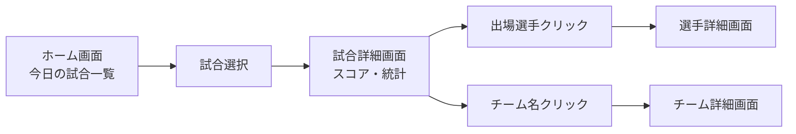
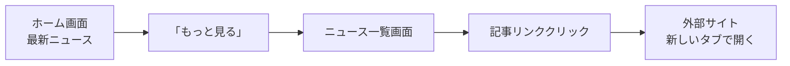

# Football Hub - 画面遷移図

## 概要

Football Hubプロジェクトの画面遷移を整理した図です。

## 画面構成概要

### 主要画面カテゴリ

- **認証系**: ログイン、ユーザー登録
- **メイン画面**: ホーム、ニュース
- **コンテンツ詳細**: リーグ、チーム、選手、試合詳細
- **ユーザー専用**: プロフィール、お気に入り

## パターン別遷移パターン

### パターン1: 新規ユーザーの登録

### パターン2: リーグ情報閲覧

### パターン3: 試合情報追跡

### パターン4: ニュース閲覧

### 認証必須ページ

- プロフィールページ
- お気に入り管理機能

### 認証状態による表示切替

- **未認証**: ログイン・登録ボタン表示
- **認証済み**: プロフィール・ログアウトボタン表示
- **お気に入りボタン**: 認証済みユーザーのみ表示

---
